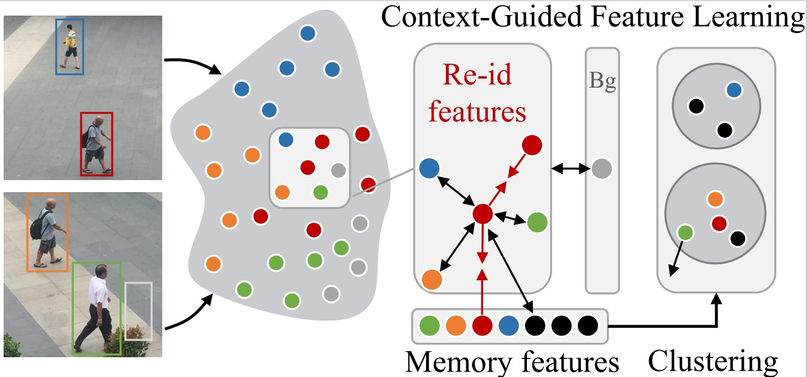

## Introduction

This is the implementation codes for [Exploring Visual Context for Weakly Supervised Person Search](https://arxiv.org/abs/2106.10506)


Overall pipeline of the proposed context-guided feature learning framework for weakly supervised person search. (a) We aim to build a framework for person search with only bounding box annotations, (b) where the re-id embeddings are jointly learned with detection. (c) We employ the detection context to pull features belonging to the same identity together, while pushing the re-id features of the pedestrians away from the background features. A hard-negative mining strategy is designed to effectively employ the information in the memory. (d) We use the scene context to generate more accurate clustering results.

## Installation

The project is based on [MMdetection](https://github.com/open-mmlab/mmdetection), please refer to [install.md](docs/install.md) to install MMdetection.

We utilized mmcv=1.2.6, pytorch=1.7.1


## Dataset

Download [CUHK-SYSU](https://github.com/ShuangLI59/person_search) and [PRW](https://github.com/liangzheng06/PRW-baseline).

We provide coco-style annotation in [demo/anno](demo/anno).

For CUHK-SYSU, change the path of your dataset and the annotaion file in the [config file](configs/_base_/datasets/coco_reid_unsup.py) L2, L35, L40, L46, L51

For PRW, change the path of your dataset and the annotaion file in the [config file](configs/_base_/datasets/coco_reid_unsup_prw.py) L2, L35, L40, L46, L51

## Experiments
  1. Train
   ```bash
   cd jobs/cuhk/
   sh train.sh
   ```
  2. Test CUHK-SYSU
Download trained CUHK [checkpoint](https://drive.google.com/file/d/1wvGUTOvncs-tjKCfSRnZLJiZt6AZ4461/view?usp=sharing).
   ```bash
   cd jobs/cuhk/
   sh test.sh
   ```
   3. Train PRW
   ```bash
   cd jobs/prw/
   sh train.sh
   ```
   4. Test PRW
Download trained PRW [checkpoint](https://drive.google.com/file/d/10MftT96ldoZU9mlTu1WYthxprRs0zd1j/view?usp=sharing).
   Change the paths in L125 in [test_results_prw.py](tools/test_results_prw.py)
   ```bash
   cd jobs/prw
   sh test.sh
   ```

## Performance

|Dataset|Model|mAP|Rank1| Config | Link |
|-----|-----|------|-----|------|-----|
|CUHK-SYSU|CGPS| 73.9%|76.0%|[cfg](configs/cgps/cuhk.py)| [model](https://drive.google.com/file/d/1wvGUTOvncs-tjKCfSRnZLJiZt6AZ4461/view?usp=sharing)| 
|PRW|CGPS|12.5%|58.1%|[cfg](configs/cgps/prw.py)| [model](https://drive.google.com/file/d/10MftT96ldoZU9mlTu1WYthxprRs0zd1j/view?usp=sharing)| 

## Reference Codes
Thanks for the great projects of [MMdetection](https://github.com/open-mmlab/mmdetection), [OpenUnReID](https://github.com/open-mmlab/OpenUnReID) and [AlignPS](https://github.com/daodaofr/AlignPS).
## License

This project is released under the [Apache 2.0 license](LICENSE).

## Citation

If you use this project in your research, please cite this project.

```
@misc{yan2021exploring,
      title={Exploring Visual Context for Weakly Supervised Person Search}, 
      author={Yichao Yan and Jinpeng Li and Shengcai Liao and Jie Qin and Bingbing Ni and Xiaokang Yang and Ling Shao},
      year={2021},
      eprint={2106.10506},
      archivePrefix={arXiv},
      primaryClass={cs.CV}
}
```
